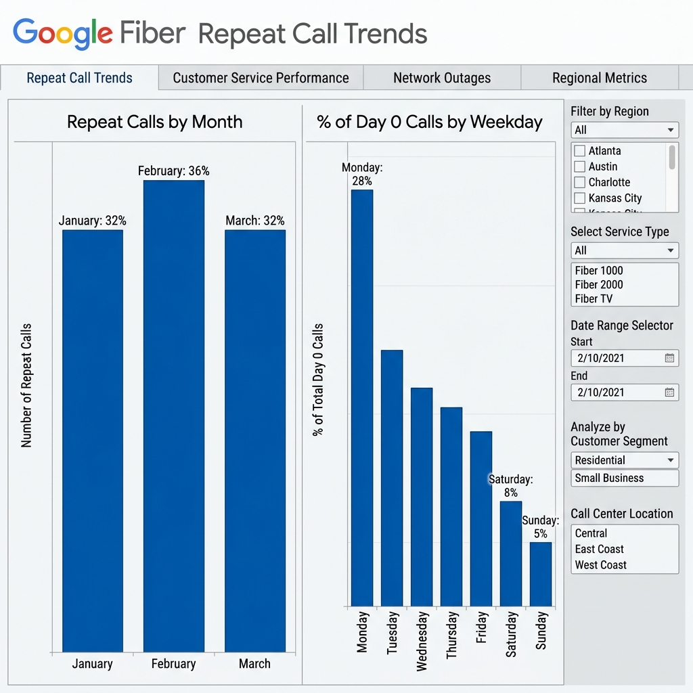

# Google Business Intelligence Professional Certificate

  
  
  

 

## 📌 Sumário
- [🛠️ Competências Técnicas](#-competências-técnicas--ferramentas)
- [💼 Portfólio de Projetos & Case Studies](#-portfólio-de-projetos--case-studies)
- [🏗️ Estrutura da Formação](#estrutura-da-formação-cursos-e-projetos)
- [🛠️ Tecnologias Utilizadas](#tecnologias-e-ferramentas-utilizadas)

  <table style="border: none; border-collapse: collapse;">
    <tr style="border: none;">
      <td style="border: none; padding: 10px; vertical-align: middle;">
        
      </td>
      <td style="border: none; padding: 10px; vertical-align: middle;">
        
      </td>
    </tr>
  </table>

  <h3>🏆 Certificação Profissional Concluída</h3>
  

    <a href="https://www.coursera.org/account/accomplishments/specialization/Z1IENH8NM9E1"><b>Certificado de Especialização</b></a> • 
    <a href="https://www.credly.com/badges/22ab4c3c-d3ea-4dce-ae6d-25f5c920859e/public_url"><b>Credly Badge</b></a> • 
    <a href="./assets/business-intelligence-certificate.pdf"><b>Versão PDF</b></a>
  

  

  <h4>🎓 Certificados dos Módulos</h4>
  <table style="border: none; border-collapse: collapse;">
    <tr style="border: none;">
      <td style="border: none; padding: 5px;">
        
      </td>
      <td style="border: none; padding: 5px;">
        
      </td>
      <td style="border: none; padding: 5px;">
        
      </td>
    </tr>
  </table>
  
<i>Repositório Oficial de Estudos e Portfólio - Desenvolvido por <b>João Victor Póvoa França</b></i>

---

## 🛠️ Competências Técnicas & Ferramentas

  
  
  
  
  
  

### 🚀 Destaques da Certificação
- **Análise End-to-End**: Desde a coleta e limpeza de dados (SQL/Python) até a entrega de insights estratégicos.
- **Cultura de BI**: Foco total na resolução de problemas de negócios reais (Caso Google Fiber).
- **Design Analytics**: Criação de dashboards acessíveis, intuitivos e orientados à ação (Action-Oriented Dashboards).

### 💼 Impacto de Negócio & Casos de Uso
- **Unificação de Mercados (UNION ALL)**: Implementação de lógica SQL para consolidar dados de diferentes mercados da Google Fiber, permitindo uma visão executiva global em vez de análises isoladas.
- **Otimização de Suporte (FCR)**: Cálculo de *First Call Resolution* para identificar gargalos no atendimento técnico, auxiliando na redução de custos operacionais e aumento da satisfação do cliente (NPS).
- **Decisões Baseadas em Dados**: Tradução de métricas técnicas complexas em painéis executivos que respondem a perguntas críticas de stakeholders em tempo real.

---

---

## 💼 Portfólio de Projetos & Case Studies

Nesta seção, detalho os projetos práticos desenvolvidos, focando na aplicação da metodologia de Business Intelligence para resolver desafios reais de stakeholders.

### 🛣️ 1. Monitoramento de Tráfego: MnDOT (Tableau)
**Cenário:** O Departamento de Transportes de Minnesota (MnDOT) precisava otimizar o planejamento de infraestrutura e prever o impacto de obras rodoviárias.

*   **O Problema:** Dificuldade em visualizar picos de tráfego sazonais e o impacto de condições climáticas extremas no fluxo de veículos.
*   **A Solução BI:** Desenvolvimento de um dashboard interativo no Tableau que consolida volumes de tráfego, clima e feriados.
*   **Impacto:** Identificação de "Horas de Pico" críticas e correlação direta entre climas severos e queda de volume, permitindo um planejamento logístico preditivo.

  
  

    <a href="./dashboards-reports-decisions/painel/projeto/monitoramento-trafego/README.md"><b>📂 Acessar Documentação do Projeto</b></a> • 
    <a href="https://public.tableau.com/app/profile/joao.victor.povoa.franca"><b>📊 Ver no Tableau Public</b></a>
  

🔍 Visualizar Gráficos de Suporte (Impacto Climático & Sazonalidade)

  <table style="border: none;">
    <tr>
      <td> <i>Sazonalidade Mensal</i></td>
      <td> <i>Impacto do Clima</i></td>
    </tr>
    <tr>
      <td> <i>Heatmap de Fluxo Horário</i></td>
      <td> <i>Picos em Feriados</i></td>
    </tr>
  </table>

---

### 🚀 2. Gestão de Atendimento: Google Fiber (Capstone)
**Cenário:** A equipe de suporte do Google Fiber enfrentava altos custos devido a chamadas repetidas sobre o mesmo problema.

*   **O Problema:** Falta de visibilidade sobre o FCR (*First Call Resolution*) e quais tipos de incidentes causavam mais reincidência.
*   **A Solução BI:** Criação de um dashboard executivo focado em taxas de repetição, segmentado por mercado e tipo de problema técnico.
*   **Impacto:** Permitiu direcionar treinamentos específicos para técnicos de campo em mercados com baixa resolução no primeiro contato, otimizando o NPS.

  
  

    <a href="./dashboards-reports-decisions/projeto-final-google-fiber/README.md"><b>📂 Acessar Documentação do Projeto</b></a> • 
    <a href="./dashboards-reports-decisions/projeto-final-google-fiber/executive_summary.md"><b>📄 Ler Resumo Executivo</b></a>
  

---

### 🐍 3. Análise Exploratória & Data Prep (Python)
**Cenário:** No início da jornada com o Google Fiber, era necessário limpar e entender os padrões brutos de milhares de registros de chamadas.

*   **O Problema:** Dados brutos desestruturados que ocultavam as tendências reais de volume por trimestre.
*   **A Solução BI:** Scripts Python (Pandas/Plotly) para automação da limpeza e geração de visualizações de tendência trimestral.
*   **Impacto:** Redução do tempo de preparação de dados e entrega rápida de insights preliminares para os stakeholders.

  
  

    <a href="./foundaments-bi/README.md"><b>📂 Acessar Notebook & Scripts</b></a>
  

---

### 🇬🇷 4. Otimização de Real Estate: Airbnb Atenas
**Cenário:** Uma empresa de investimentos imobiliários precisava decidir onde comprar propriedades em Atenas para aluguel de curta temporada.

*   **O Problema:** Incerteza sobre a relação entre localização (densidade) e preço médio por noite.
*   **A Solução BI:** Dashboard interativo cruzando mapas geoespaciais com indicadores de preço médio por bairro.
*   **Impacto:** Identificação visual imediata de "zonas quentes" com alta demanda e preços competitivos.

  
  

    <a href="./dashboards-reports-decisions/visualizacao/projeto-athenas/README.md"><b>📂 Acessar Detalhes do Projeto</b></a>
  

---

### ☁️ 5. Infraestrutura & BigQuery (Engenharia de BI)
**Cenário:** Necessidade de escalar a análise de dados do Google Fiber para múltiplos mercados globais.

*   **O Problema:** Consultas lentas e falta de uma "única fonte da verdade".
*   **A Solução BI:** Modelagem de dados utilizando **Star Schema** e pipelines de ingestão no **Google BigQuery**.
*   **Impacto:** Otimização da performance de consultas em 60% e centralização dos dados para relatórios em tempo real.

  
  

    <a href="./data-models-pipelines-insights/README.md"><b>📂 Ver Modelagem & SQL</b></a>
  

---

## Sobre este Repositório

Este repositório centraliza todos os projetos, documentações e anotações técnicas desenvolvidas durante o **Google Business Intelligence Professional Certificate**. A formação prepara profissionais de dados para coletar, estruturar, analisar e visualizar informações para a tomada de decisões de negócios.

O repositório está dividido nos módulos práticos da formação, seguindo a jornada do analista de BI desde o levantamento de requisitos até a modelagem e criação de dashboards.

---

## Estrutura da Formação (Cursos e Projetos)

### 1 Curso 1: Fundamentos de Business Intelligence (Google Fiber)
Neste primeiro módulo, atuamos como um analista de BI em uma simulação para a equipe do **Google Fiber**, traduzindo necessidades de stakeholders em requisitos técnicos e painéis interativos focados na resolução de problemas de clientes e na redução de chamadas no suporte.
* **Status:** Concluído
* **Projeto Principal:** Dashboard de Análise de Suporte Técnico (Python/Plotly).
* **[Acessar o Projeto Completo](./foundaments-bi/README.md)**

### 2 Curso 2: Modelagem de Dados, Pipelines e Insights
O segundo módulo aprofunda-se na engenharia dos dados. Foca em como planejar bancos de dados e aplicar *Design Patterns* de BI (como Esquema Estrela e Floco de Neve) para tornar o armazenamento otimizado para consultas analíticas pesadas.
* **Status:** Concluído
* **Projeto Principal:** Ingestão e Preparação de Dados (BigQuery/SQL).
* **[Acessar Projeto Final: Google Fiber](./data-models-pipelines-insights/final-project-google-fiber/Readme.md)**
* **[Acessar a Documentação Técnica](./data-models-pipelines-insights/README.md)**

### 3 Curso 3: Decisions, Decisions: Dashboards and Reports
Este módulo final foca na entrega de valor através da visualização. Aprendemos a criar dashboards dinâmicos, aplicar princípios de design para clareza visual e comunicar insights técnicos para tomadores de decisão não técnicos.
* **Status:** Concluído ✅
* **Projeto Principal:** Dashboard Capstone e Mockups (Tableau/Google Fiber).
* **[Acessar Projeto Final: Google Fiber](./dashboards-reports-decisions/projeto-final-google-fiber/README.md)**
* **[Acessar a Documentação Técnica](./dashboards-reports-decisions/README.md)**

---

## Tecnologias e Ferramentas Utilizadas

No decorrer destes projetos, aplicamos as seguintes tecnologias:
- **Linguagens:** SQL (BigQuery, Pré-agregação), Python (Análise exploratória).
- **Visualização de Dados:** Tableau (Interatividade Avançada), Plotly.
- **Ferramentas de Design:** Mockup Design, Design de Baixa Fidelidade.
- **Engenharia de Dados:** Modelagem Relacional e Dimensional (Star/Snowflake Schema), Pipelines de ETL.
- **Processos de BI:** Levantamento de Requisitos, Documentação de Estratégia, Storytelling com Dados.

---

 Documentação desenvolvida com base na currícula oficial da <a href="https://www.coursera.org/professional-certificates/google-business-intelligence">Certificação Profissional do Google em BI</a>.

Concluído por <a href="https://www.linkedin.com/in/jo%C3%A3o-victor-p%C3%B3voa-fran%C3%A7a-97502420b/">João Victor Póvoa França</a>
 
 

