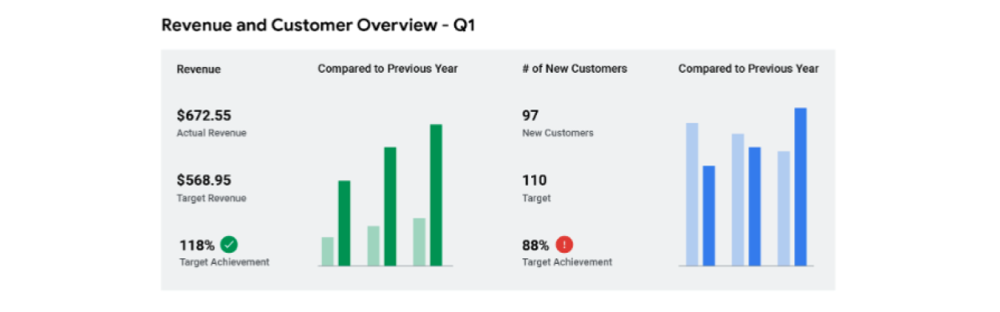
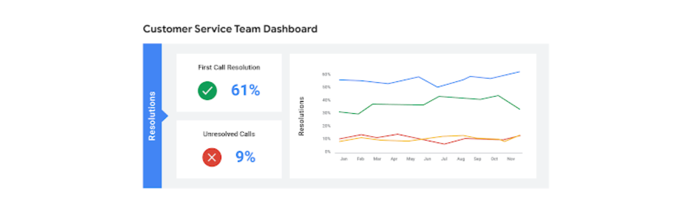

# Base: Painéis e Tomada de Decisão

O monitoramento e a exibição de dados comerciais importantes são fundamentais no Business Intelligence (BI). O principal objetivo de rastrear esses dados e consolidá-los em um painel (dashboard) é permitir que as partes interessadas (stakeholders) respondam às suas próprias perguntas sobre os dados de forma autônoma e eficiente.

Para que um painel seja eficaz, ele deve ser claro, demonstrar os Indicadores Chave de Desempenho (KPIs) de maneira direta e estar alinhado às necessidades de quem o consome. No contexto de BI, os dashboards são geralmente classificados em três categorias principais: Estratégico, Operacional e Analítico.

---

## Tipos de Painéis

Os profissionais de BI adaptam os dashboards para propósitos específicos, garantindo que a informação certa chegue à pessoa certa no momento correto.

### Painéis Estratégicos

Os painéis estratégicos são utilizados para avaliar e alinhar os objetivos de longo prazo de uma organização. Eles focam no mais alto nível de métricas e fornecem informações sobre períodos extensos, que podem variar de um trimestre financeiro a vários anos.

Normalmente, esses painéis contêm informações cruciais para a tomada de decisões em nível executivo, focando em KPIs que refletem a saúde geral e o progresso da empresa em relação às suas metas globais.

### Painéis Operacionais

Os painéis operacionais são o tipo mais comum de dashboard. Eles rastreiam o desempenho de curto prazo e metas intermediárias, operando em uma escala de tempo de dias, semanas ou meses.

Por fornecerem informações quase em tempo real, permitem que as empresas acompanhem e mantenham seus processos operacionais imediatos, garantindo que as atividades diárias estejam alinhadas aos objetivos estratégicos. Um exemplo comum é o monitoramento do desempenho de equipes de suporte ou logística.

### Painéis Analíticos

Os painéis analíticos são a categoria mais técnica e complexa. Eles consistem em conjuntos de dados detalhados e na aplicação de matemática e estatística sobre esses dados para identificar tendências e realizar previsões.

Geralmente criados e mantidos por equipes de Ciência de Dados, esses painéis focam em métricas profundas, como o retorno sobre ativos, índices de capital e balanços detalhados, servindo de base para análises preditivas sofisticadas.

---

## Principais Conclusões

Como profissional de BI, a criação de painéis visa capacitar as partes interessadas com acesso aos dados necessários para:

- Responder a perguntas de negócio de forma independente.
- Identificar e resolver problemas operacionais com agilidade.
- Tomar decisões baseadas em evidências e dados concretos.

Reconhecer e saber quando aplicar cada tipo de painel é uma habilidade essencial para criar ferramentas que atendam aos requisitos comerciais específicos de uma organização.

---

## Diferenciando o Escopo

No Business Intelligence, a palavra "escopo" pode ser usada em diferentes contextos. É fundamental entender se estamos discutindo o projeto como um todo ou a ferramenta específica (o painel).

| Característica | Escopo do Projeto | Escopo do Painel |
| :--- | :--- | :--- |
| **Definição** | Refere-se às metas gerais do projeto, recursos, entregas, prazos, colaboradores e partes interessadas. | Refere-se à amplitude do que um painel está rastreando, incluindo períodos de tempo e quantidade de métricas. |
| **Responsabilidade** | Determinado pela liderança da equipe, incluindo patrocinadores e gerentes de projeto. | Determinado pelas equipes de BI considerando os requisitos do projeto e as necessidades do usuário. |
| **Cronograma** | Delineado logo no início para definir os aspectos globais da iniciativa. | Delineado como parte do processo de criação do painel, baseado em necessidades específicas de relatórios. |
| **Foco de Atuação** | Envolve alinhar metas gerais e garantir que o projeto inteiro faça sentido para a organização. | Envolve a escolha de KPIs, tempo de representação e acessibilidade dos dados para os tomadores de decisão. |

Compreender essa distinção ajuda o profissional de BI a gerenciar expectativas, focando no que a ferramenta deve entregar tecnicamente sem perder de vista os objetivos macro do negócio.
