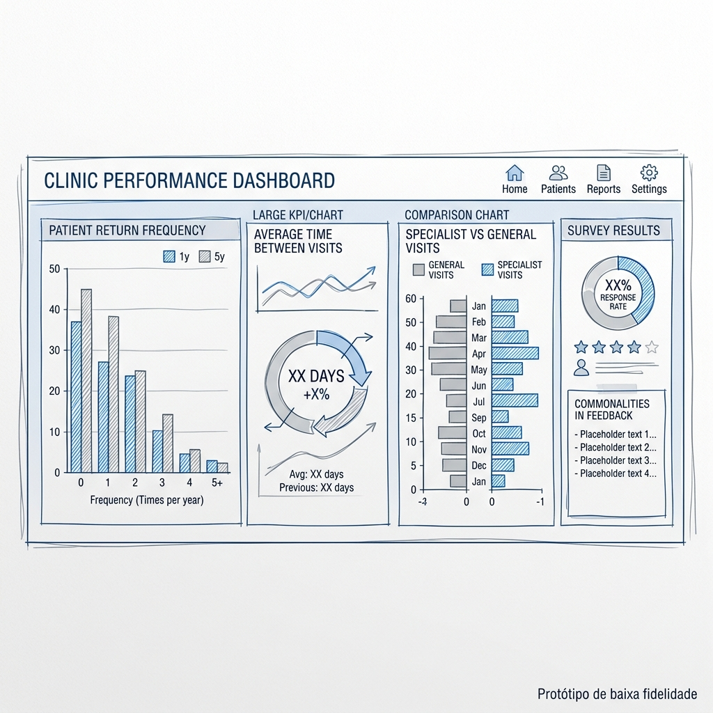

# Atividade: Prototipagem de Baixa Fidelidade - Clínica Médica

Nesta atividade, desenvolvemos um protótipo de baixa fidelidade (mockup) para um consultório médico particular. O objetivo do painel é ajudar a clínica a entender a retenção de pacientes e como atender melhor às suas necessidades médicas.

---

## Cenário e Objetivos

O dashboard foi projetado para responder a quatro perguntas fundamentais:
1. **Frequência de visitas**: Quantas vezes os pacientes retornam em 1 e 5 anos?
2. **Tempo médio entre visitas**: Qual o intervalo típico entre consultas?
3. **Especialistas vs. Consultas Gerais**: Qual a diferença de comportamento entre pacientes com condições específicas e consultas de rotina?
4. **Pesquisas de Satisfação**: Qual a taxa de adesão e quais padrões emergem das respostas dos pacientes?

---

## Protótipo do Dashboard

O mockup abaixo representa a organização visual proposta para responder às necessidades dos stakeholders.

### Detalhamento das Visualizações

- **Frequência de Retorno (Bar Chart)**: Localizado no topo, compara o volume de visitas recorrentes em janelas de 1 e 5 anos, permitindo identificar a fidelidade do paciente a longo prazo.
- **KPI de Tempo Médio**: Um indicador de destaque que mostra o intervalo médio entre visitas. Isso ajuda a clínica a prever a demanda e entender o ciclo de cuidado.
- **Segmentação Especialista vs. Geral**: Um gráfico de comparação que destaca se pacientes com condições crônicas ou específicas visitam a clínica com mais ou menos frequência que pacentes de rotina.
- **Painel de Pesquisas**: Seção dedicada à análise das 5 perguntas de satisfação, mostrando o volume de preenchimento e cruzando dados para encontrar características comuns entre respondentes.

### Refinamento via Exemplo de Referência

Ao comparar a versão inicial com o exemplo de referência do curso, foram identificados elementos cruciais para aumentar a interatividade e a clareza do painel:

- **Filtros Interativos**: Inclusão de controles de seleção para refinar os dados por **horário, local, especialidade e paciente específico**. Isso permite que o stakeholder personalize a visão conforme a necessidade imediata.
- **Cartões de Scorecard com Tendências**: Uso de métricas principais (Ex: Total de Pacientes, Tempo de Espera) acompanhadas de **setas de performance** (vermelha/verde) indicando se o número aumentou ou diminuiu em relação ao período anterior.
- **Gráficos de Pizza para Pesquisas**: Substituição ou complemento das métricas de texto por gráficos de pizza, facilitando a visualização da distribuição percentual das respostas para as 5 perguntas de satisfação.

---

## Perguntas de Acompanhamento para Stakeholders

Como parte da fase de planejamento, identificamos lacunas que precisam ser esclarecidas para refinar o dashboard:

1. **Definição de Especialistas**: Quais "condições específicas" são prioritárias para o monitoramento neste momento (ex: diabetes, cardiologia)?
2. **Metas de Pesquisa**: Existe um benchmark ou meta para a taxa de preenchimento das pesquisas de satisfação?
3. **Ações Práticas**: Que tipo de ação a clínica pretende tomar com base no dado de "tempo médio entre visitas"? (ex: lembretes automáticos de retorno).

---

## Resolução do Teste Teórico

Abaixo, os conceitos fundamentais explorados nesta atividade:

### Pergunta 2: Finalidade da Maquete
As principais finalidades de criar uma maquete antes do painel final são:
- **Ajuda a evitar possíveis erros** no painel final, economizando tempo de desenvolvimento.
- **Ajuda a restringir os detalhes visuais gerais**, focando na utilidade antes da estética.
- **Dá às partes interessadas a oportunidade de feedback antecipado**, garantindo o alinhamento de expectativas.

### Pergunta 3: Abordagem de Visualização
Representar as principais conclusões no topo (em gráficos maiores) e entrar em detalhes nos gráficos inferiores é conhecido como:
- **Funilamento** (ou técnica de afunilamento de informações).

### Pergunta 4: Eficácia dos Mockups
Para serem eficazes, os mockups devem:
- Ter detalhes **claros e arrojados**.
- **Comunicar suas intenções** de forma óbvia.
- Ser **fáceis de entender** para qualquer stakeholder, independentemente do nível técnico.

---

## Autoavaliação e Reflexão

### O que foi feito bem?
- A estrutura inicial focou corretamente nas perguntas de negócio (KPIs de frequência e tempo médio).
- A disposição visual seguiu a técnica de funilamento, priorizando conclusões amplas no topo.

### Onde a maquete pode melhorar?
- **Interatividade**: A inclusão de filtros é essencial para transformar um gráfico estático em uma ferramenta de exploração de dados.
- **Contexto Comparativo**: Adicionar indicadores de tendência (setas) fornece contexto imediato sobre o desempenho, respondendo não apenas "quanto", mas "se estamos melhorando".
- **Clareza Visual**: O uso de gráficos de pizza para surveys é mais intuitivo para proporções do que apenas tabelas ou listas de texto.
