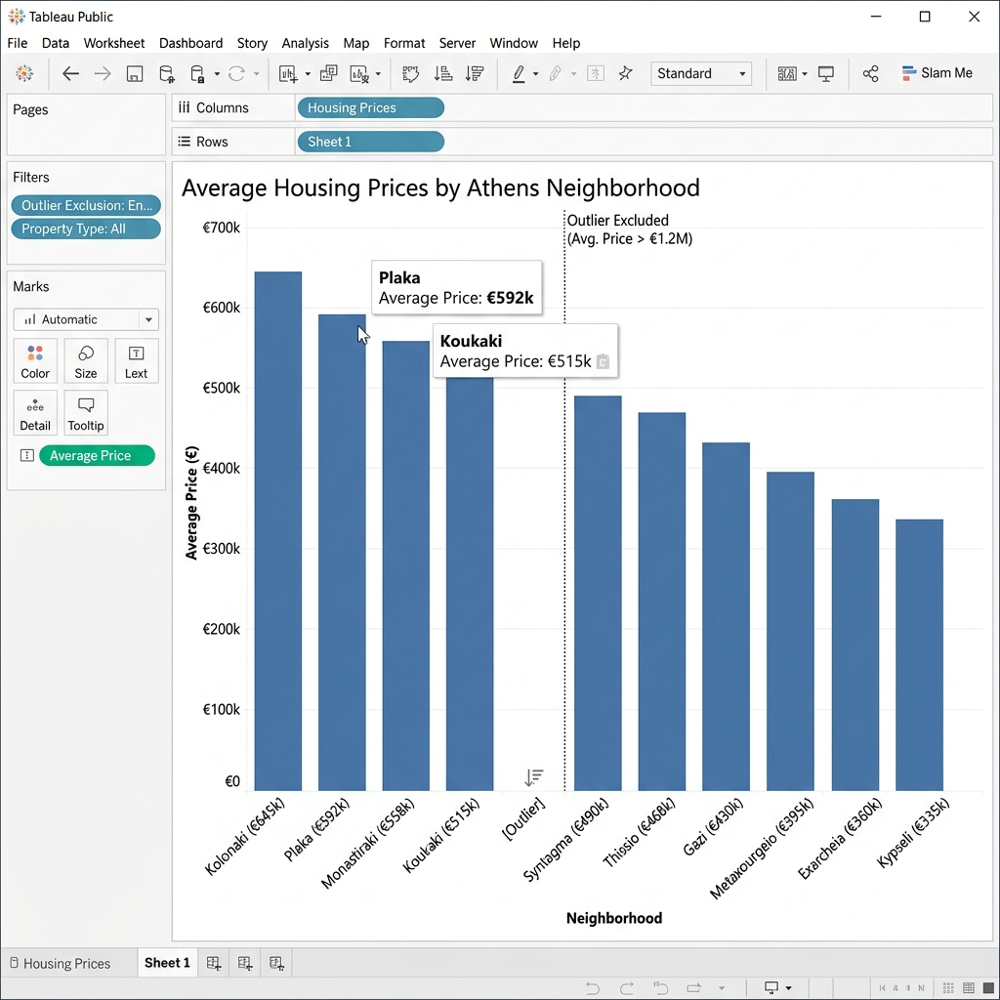
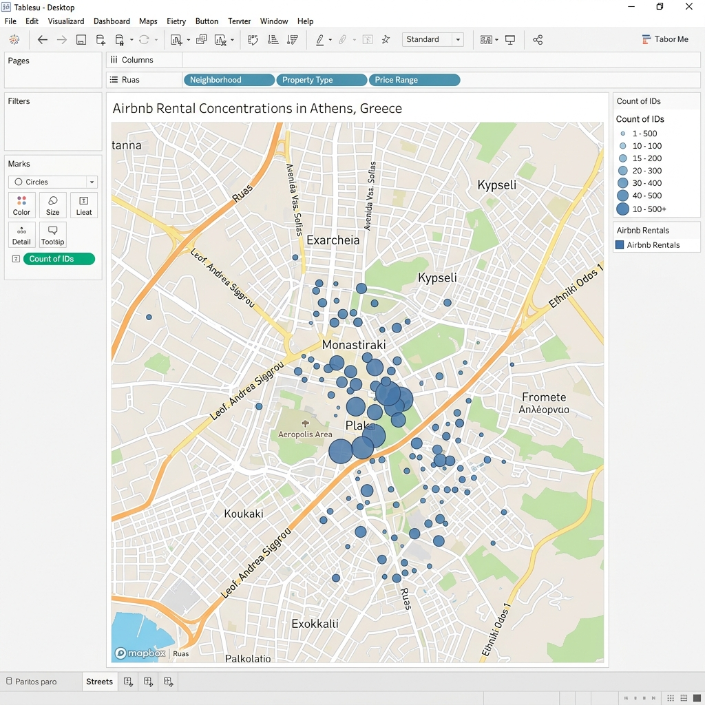
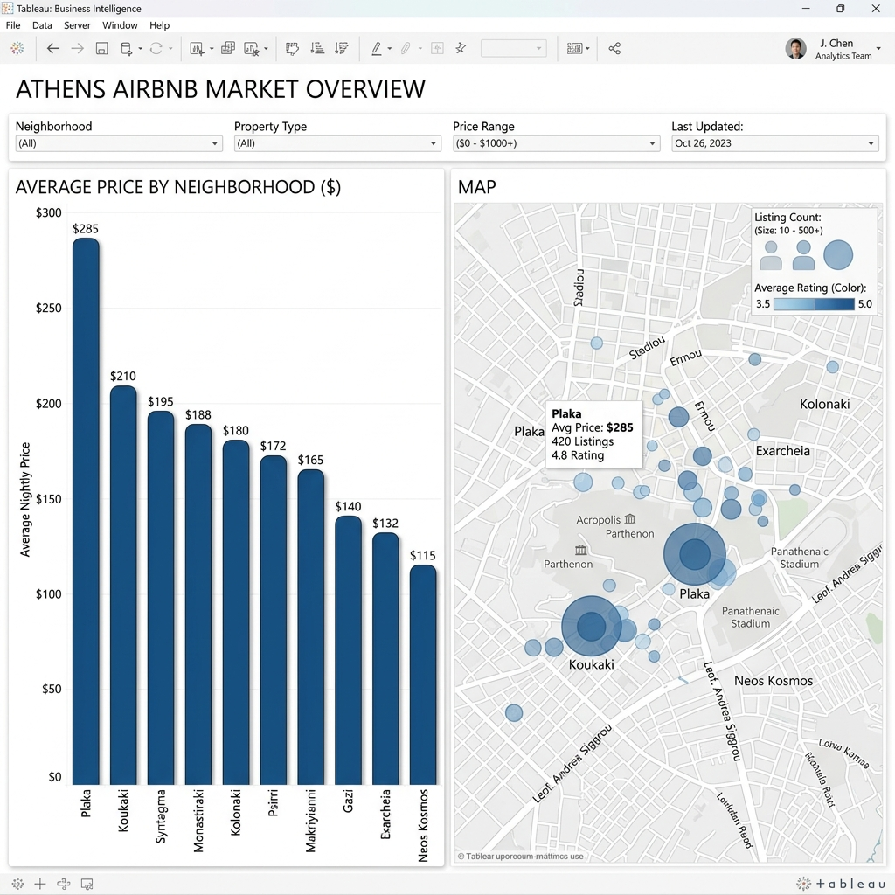

# 🏠 Projeto: Estudo de Caso Airbnb Atenas

Este projeto foca na criação de um **Painel de Controle Tático** para suporte à decisão em investimentos imobiliários. Utilizamos dados reais de aluguéis por temporada em Atenas, Grécia, para identificar oportunidades de mercado.

---

## 🎯 Objetivo e Estratégia de BI
O objetivo é transformar 1.6MB de dados brutos em uma ferramenta que responda:
1. Qual o preço médio por noite em cada bairro?
2. Onde estão as maiores concentrações de oferta?
3. Existe correlação entre densidade de imóveis e preço praticado?

---

## 📊 Construção das Visualizações Técnicas

### 1. Preço Médio por Bairro (Análise de Barras)
- **Técnica de Limpeza**: Remoção de outliers. Identificamos bairros com preços desproporcionais que distorciam a escala do eixo Y.
- **Configuração**:
    - `Neighborhood` -> Colunas.
    - `AVG(Price)` -> Linhas.
    - **Ordenação**: Descendente para destacar imediatamente os bairros mais valorizados.

### 2. Mapa de Densidade Geoespacial
- **Técnica**: Codificação de tamanho baseada em IDs.
- **Configuração**:
    - `Longitude` / `Latitude` configurados como **Dimensões**.
    - `COUNT(IDS)` arrastado para o campo **Tamanho**.
    - **Camadas de Mapa**: Uso do estilo "Ruas" para fornecer contexto urbano e reconhecimento de bairros históricos.

### 3. Scorecard de Performance (KPIs)
- Visualização de alto nível com a média de preço global e contagem total de anúncios para estabelecer a escala do mercado antes do drill-down.

---

## 🏗️ Painel de Controle e Interatividade

A força deste projeto reside na conexão dinâmica entre o mapa geográfico e o gráfico de análise financeira.

### 3.1 Interatividade Tática:
- **Action Filters ("Use as Filter")**: O mapa foi configurado como um gatilho de filtro. Ao selecionar um cluster de pontos no mapa, o gráfico de barras é atualizado em tempo real para mostrar a média de preços daquela micro-região.
- **Hierarquia Visual**: O dashboard utiliza um layout lado a lado (*Tiled*), mantendo as legendas de tamanho e cor próximas aos respectivos gráficos para evitar confusão.

---

## ✍️ Respostas Técnicas e Justificativas

### 1. Por que tratar Outliers?
A remoção temporária de outliers é vital para a **proporcionalidade visual**. Sem isso, uma única propriedade de luxo extrema pode "esmagar" as barras de bairros normais, impedindo a visualização de tendências e variações reais entre a maioria dos dados.

### 2. O Papel das Legendas
No mapa de Atenas, a legenda é o que diferencia um "ponto isolado" de uma "zona de alta concentração". Ela decodifica o tamanho dos círculos em valores numéricos (Contagem de IDs), permitindo uma interpretação quantitativa rápida.

### 3. Sugestão de Expansão (Comparação Direta)
Para visualizar simultaneamente o Preço Médio e o Volume de Anúncios por bairro, a técnica recomendada seria o uso de **Barras Agrupadas** ou um **Eixo Duplo**, permitindo correlações diretas em uma única visão.

---
## 📦 Arquivos do Projeto
- 📊 [Fonte de Dados: Athens Airbnb](./data/athens-data.csv)
- 🖼️ [Repositório de Assets Visuais](./assets/)

---
*Status: Estudo de Caso Airbnb Atenas Finalizado com Rigor Analítico.*
