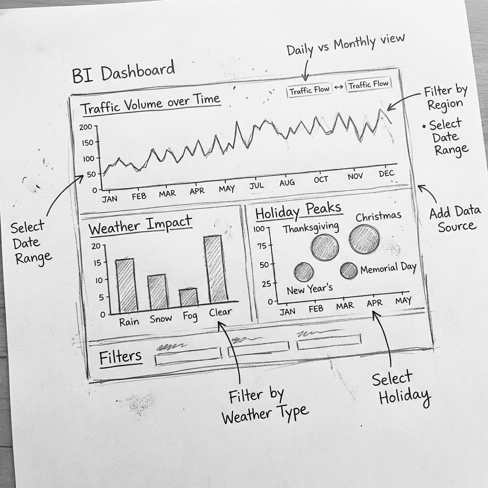
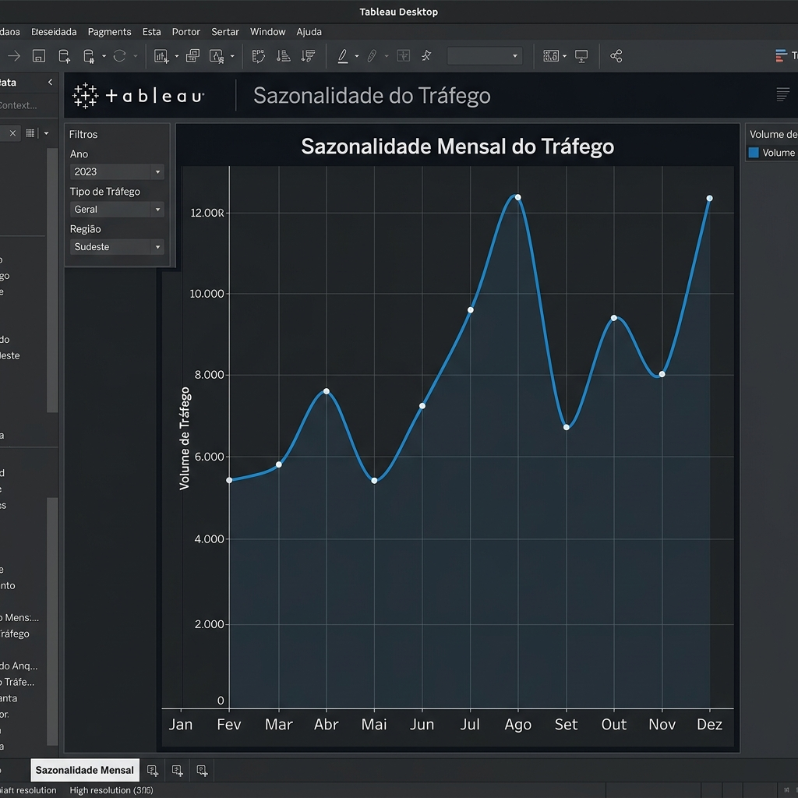
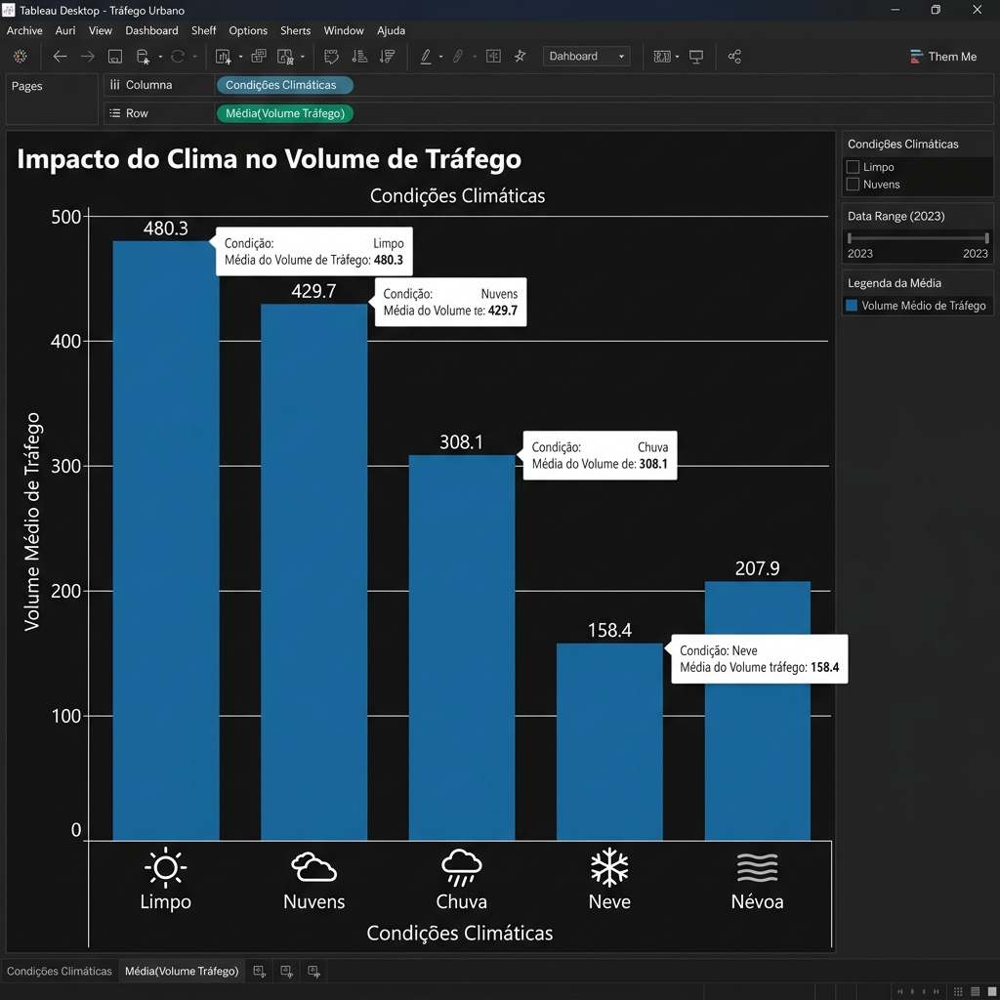
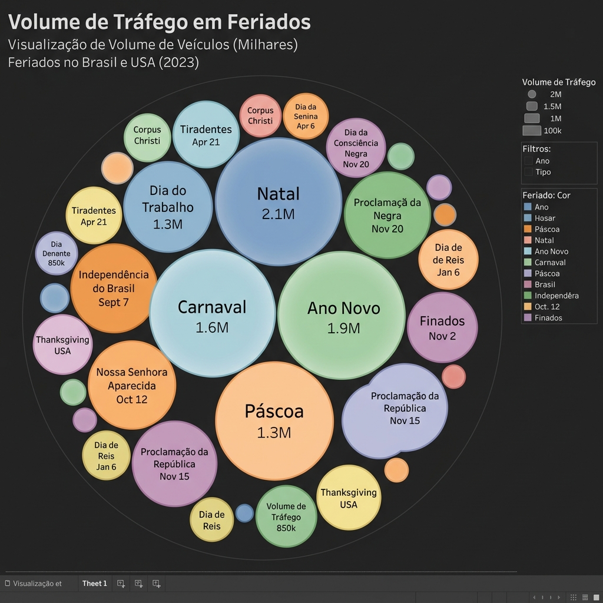
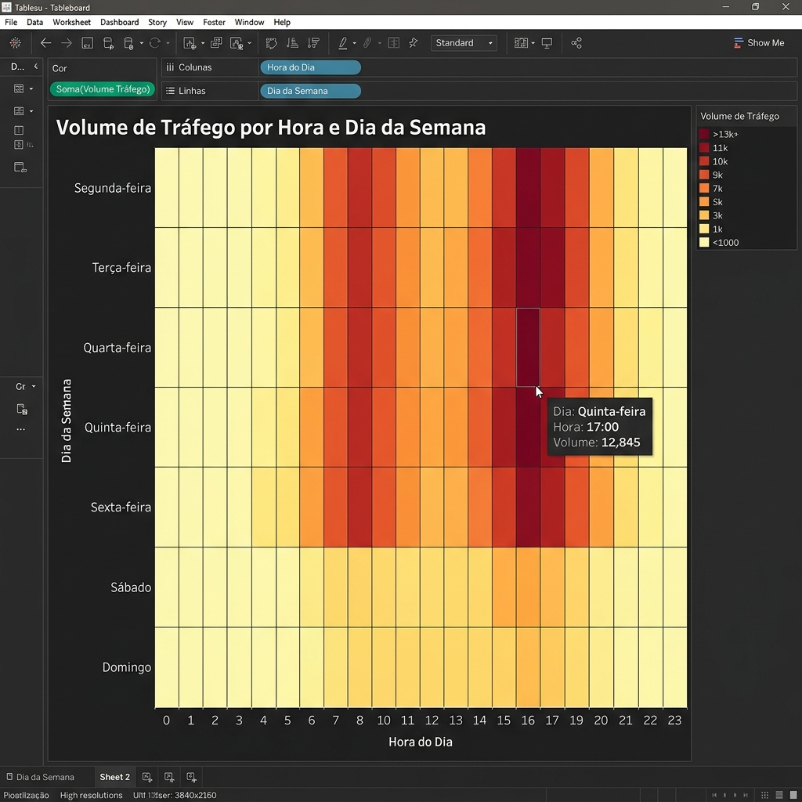
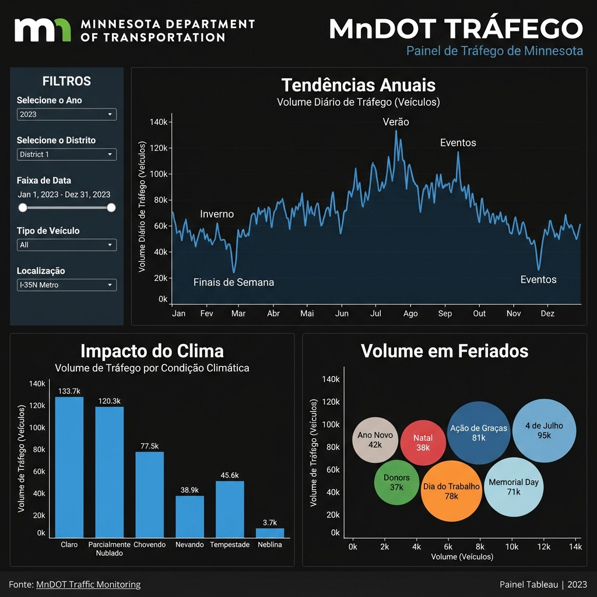
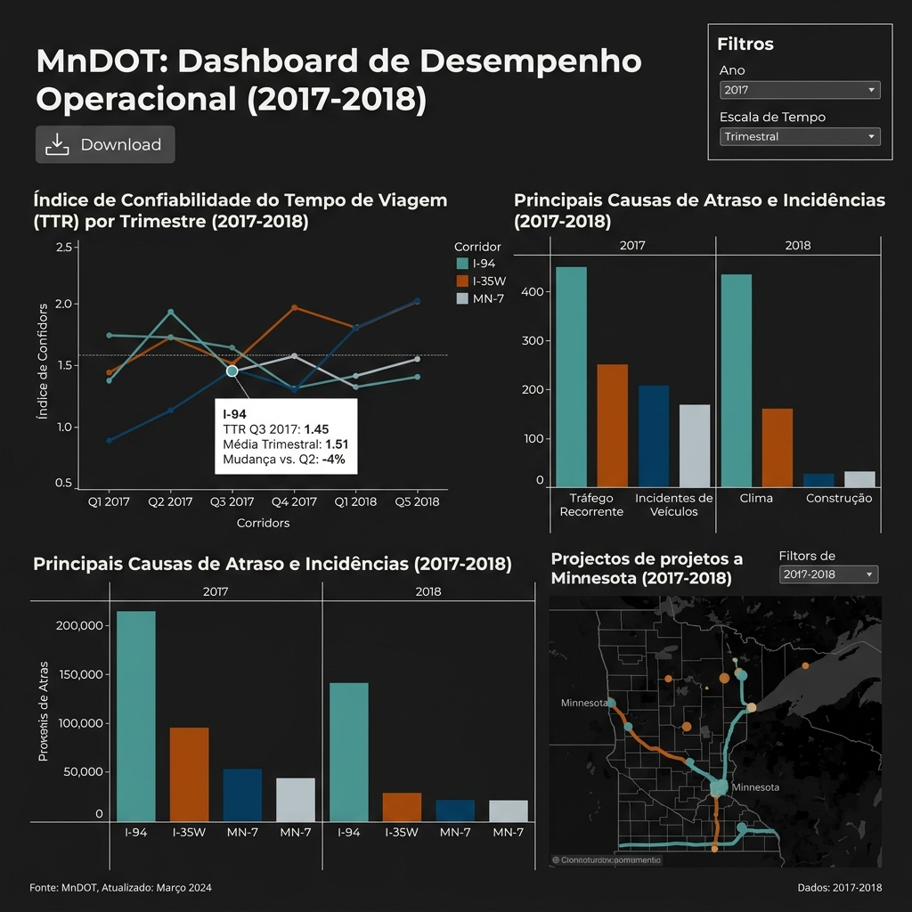

# Documentação do Projeto: Monitoramento de Tráfego (MnDOT)

Este documento detalha o processo de planejamento, execução e iteração dos gráficos para o monitoramento de padrões de tráfego em Minnesota.

---

## 🎨 Parte 1: Planejamento (Mockup de Baixa Fidelidade)

---

## 📊 Parte 2: Criação dos Gráficos

### 1. Sazonalidade (Linhas)

### 2. Impacto Climático (Barras)

### 3. Picos em Feriados (Bolhas)

### 4. Volume por Hora e Dia (Mapa de Calor)

---

## 🏗️ Parte 3: Montagem do Dashboard (Rascunho Inicial)

---

## 🔄 Parte 4: Iteração e Refinamento (Feedback do Stakeholder)

Após a revisão da Camila (Stakeholder), implementamos melhorias iterativas para aumentar a usabilidade e o foco nos dados relevantes.

### Feedback Recebido:
- **Usabilidade**: Facilitar o uso para membros da equipe não familiarizados com o Tableau.
- **Acesso a Dados**: Incluir opção de download direto.
- **Foco Temporal**: Filtrar apenas dados de 2017 em diante.

### Implementações Realizadas:
1.  **Filtros em Menu Suspenso**: 
    - Transformamos os filtros de "Data e Hora" em menus suspensos (*Drop-down*). 
    - Aplicamos a configuração **"All Using Related Data Sources"** para garantir que uma seleção filtre todos os gráficos simultaneamente.
2.  **Objeto de Download**:
    - Adicionamos um botão de **Download** (Objeto de Painel) que permite exportar a visualização como PDF ou Imagem diretamente da interface.
3.  **Filtro de Escopo (2017+)**:
    - Configuramos um filtro global de data para iniciar em 01/01/2017, mantendo a flexibilidade de escala (Mês, Dia, Hora).
4.  **Dicas de Ferramenta (Tooltips) Avançadas**:
    - Refinamos os tooltips para incluir descrições textuais que explicam o insight sem a necessidade de treinamento prévio.

### Painel Atualizado (Versão 2.0)

---

## 📝 Auto-Reflexão e Critérios Atendidos

- [x] **Três ou mais gráficos**: Linhas, Barras, Bolhas e Heat Map.
*   [x] **Hierarquia Visual**: Tendência anual no topo, detalhes na base.
*   [x] **Iteração por Feedback**: Atendimento total às solicitações da Camila.
*   [x] **Acessibilidade**: Legendas, tooltips e menus simplificados.

---

## 🏁 Avaliação Final do Protótipo (Baseada no Exemplar Concluído)

Após comparar nossa iteração com o exemplar final do curso, validamos nossas decisões de design e identificamos o valor estratégico de cada elemento:

### Análise de Posicionamento:
*   **Bloco de Filtro**: Assim como sugerido, posicionamos o menu suspenso no **topo do dashboard**. Isso reforça sua importância global, permitindo que usuários não técnicos ajustem o escopo temporal antes de analisar os dados.
*   **Botão de Download**: Optamos pelo posicionamento no **topo (próximo ao título)**. Esta decisão atende à necessidade de stakeholders que precisam gerar relatórios rápidos para reuniões, permitindo acesso imediato à exportação sem a necessidade de rolar o painel.
*   **Eficiência de Escopo**: O uso do filtro de data (2017+) provou ser a solução mais rápida e eficaz para atender à mudança de escopo solicitada, sem exigir alterações estruturais complexas no banco de dados.

### Principais Conclusões do Exercício:
Este projeto de dramatização demonstrou o ciclo completo de um profissional de BI:
1.  **Entendimento**: Traduzir e-mails e solicitações em requisitos técnicos.
2.  **Construção**: Criar visualizações que equilibram estética e funcionalidade.
3.  **Comunicação**: Justificar decisões de design e responder ao feedback.
4.  **Iteração**: Refinar o produto final para atender às necessidades em constante evolução do negócio.

---
## 📦 Entrega Final
O painel consolidado e os relatórios de apoio estão organizados em:
- 🖼️ [Dashboard Final Iterado](assets/iterated_dashboard.png)
- 📄 [Relatório Técnico MnDOT (Simulado)](assets/Minnesota_Interstate_Traffic_Volume.md)

---
## Documentação Relacionada
- [Respostas: Criação de Gráficos](desafio-graficos.md)
- [Respostas: Organização do Painel](desafio-dashboard.md)
- [Respostas: Iteração do Painel](desafio-iteracao.md)

---
*Status: Ciclo de Vida do Projeto MnDOT Finalizado.*
