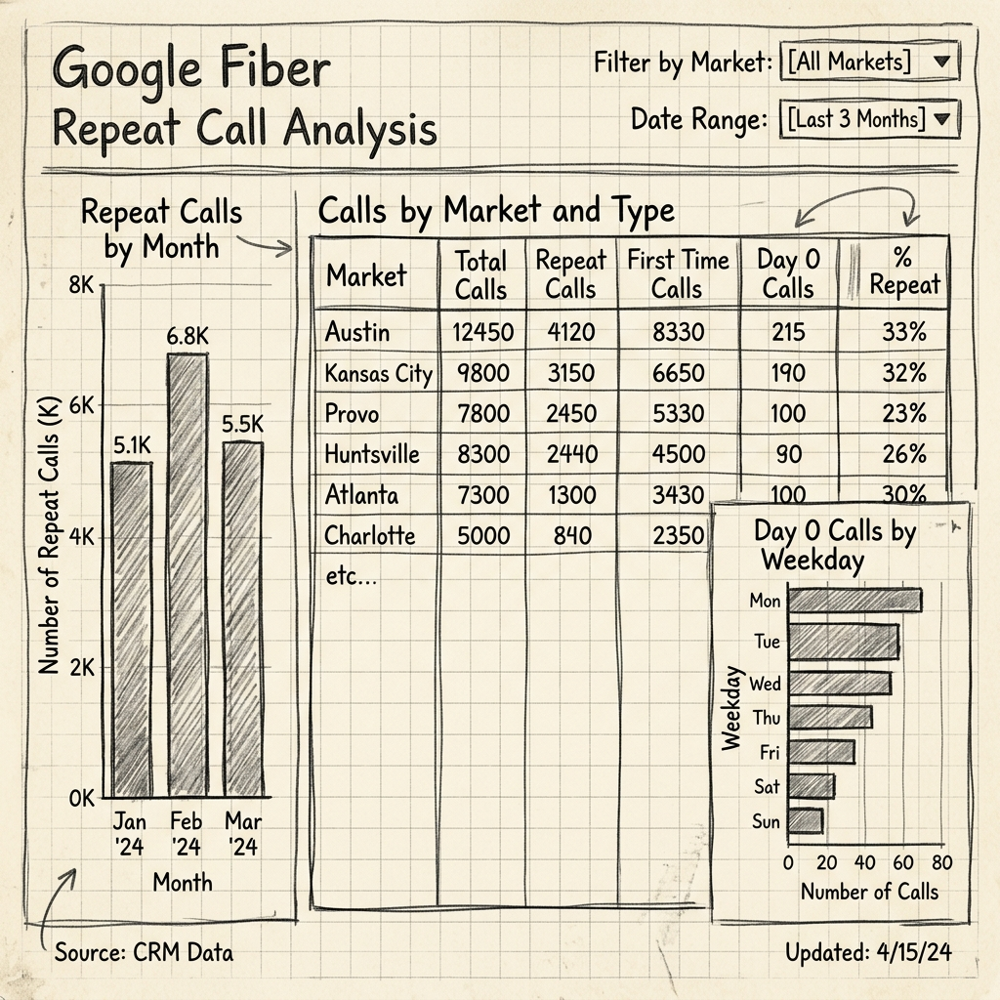

# 🚀 Projeto de Conclusão de Curso: Google Fiber

Este projeto final consolida todas as competências de Business Intelligence adquiridas ao longo do programa, focando na análise de chamadas repetidas para a equipe de atendimento ao cliente do Google Fiber.

---

## 🎨 Parte 1: Planejamento (Mockup de Baixa Fidelidade)

O planejamento inicial foca na organização dos componentes para responder às perguntas críticas da liderança sobre a eficácia do suporte no primeiro contato.

---

## 📊 Parte 2: Construção do Dashboard (Tableau)

O dashboard foi estruturado em quatro dimensões principais para permitir o drill-down de dados:

### 1. Tendências Temporais (Mês e Semana)
- **Visualização**: Gráficos de barras mostrando a cadência de chamadas repetidas por mês.
- **Insight**: Identificação de picos sazonais de reincidência.
- **Distribuição Semanal**: Porcentagem de primeiros contatos (Dia 0) por dia da semana (ex: Segunda-feira como pico de novos problemas).

### 2. Tabelas de Detalhamento
- **Exploração Granular**: Tabelas cruzando Data da Primeira Chamada vs. Tipo de Problema.
- **Segmentação por Mercado**: Visão específica das três cidades de operação para identificar disparidades regionais.

### 3. Análise por Tipo de Problema
- **Foco**: Quais problemas geram mais chamadas repetidas? (ex: Falhas Técnicas vs. Dúvidas de Faturamento).
- **Ação**: Direcionamento de treinamento para a equipe de suporte em temas críticos.

### 4. Visão Trimestral (Q1)
- Comparação entre o volume total de chamadas iniciais e a taxa de repetição por mercado.

---

## 📝 Parte 3: Resumo Executivo (Capstone)

**Objetivo do Projeto**: Determinar a frequência de chamadas repetidas para medir a eficácia da resolução no primeiro contato (FCR - First Call Resolution).

**Metodologia de BI**:
1.  **Limpeza**: União de tabelas de suporte, mercado e problemas.
2.  **Modelagem**: Criação de uma tabela de relatórios consolidada no BigQuery/SQL.
3.  **Visualização**: Design centrado no usuário no Tableau, utilizando hierarquia visual e filtros de mercado.

**Principais Descobertas**:
- Existe uma correlação entre o dia da semana do primeiro contato e a probabilidade de retorno na mesma semana.
- Mercados específicos apresentam maior reincidência em problemas de "Configuração de Equipamento", sugerindo a necessidade de manuais de autoatendimento mais claros.

---
## 📦 Arquivos do Projeto
- 🖼️ [Galeria de Ativos (Screenshots)](./assets/)
- 📄 [**Resumo Executivo Detalhado (Análise Técnica)**](./executive_summary.md)
- ✅ [**Checklist de Avaliação Final (Certificação)**](./avaliacao-final.md)
- 📊 [**Dataset Simulado (CSV)**](./data/google_fiber_calls_q1_simulated.csv): Dados sintéticos para demonstração de FCR e tendências de reincidência.
- 🐍 [Script de Geração de Dados](./data/generate_data.py): Código Python para simulação de volumes e picos sazonais.

---
*Status: Projeto Final de BI CONCLUÍDO e VALIDADO.*
